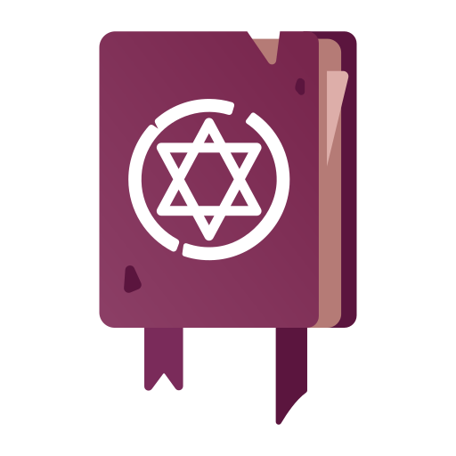

# Overview
Godot UI Crafts is a collection of useful User Interface crafts for use when creating projects in Godot Game Engine. Each folder under `Project\` will contain two projects `Completed\` and `Skeleton\` meant to be used with [Godot Engine](https://godotengine.org), the open source
2D and 3D game engine. 

## Godot Versions

- The [`main`](https://github.com/godotengine/godot-demo-projects) branch is compatible with the latest stable Godot version (currently 3.2.3).

# Importing a project

To import a project in the project manager:

- Clone this repository or [download a ZIP archive](https://github.com/GameDev-One/Godot-UI-Crafts/archive/main.zip).
  - If you've downloaded a ZIP archive, extract it somewhere.
- Open the Godot project manager and click the **Scan** button on the right.
- Choose the path to the folder either `Completed\` or `Skeleton\` and select OK.
- The project should now appear in the project manager.

## Useful links

- [Main website](https://godotengine.org)
- [Source code](https://github.com/godotengine/godot)
- [Documentation](http://docs.godotengine.org)
- [Community hub](https://godotengine.org/community)

## License

Those demos are distributed under the terms of the MIT license, as
described in the [LICENSE.md](LICENSE.md) file.